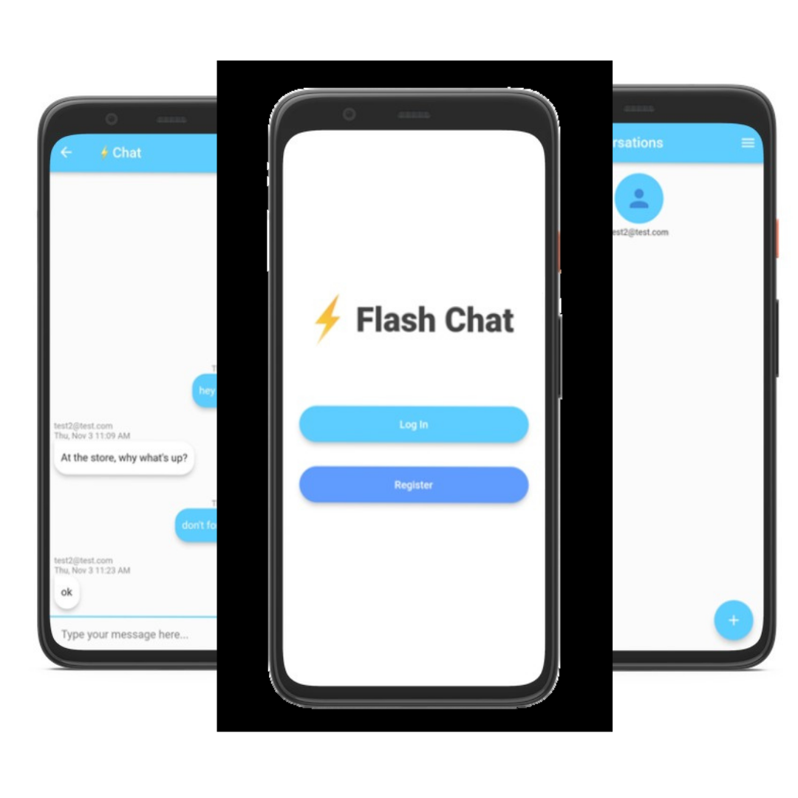

# Flash Chat Messaging App

## Table of contents

- [Overview](#overview)
- [Screenshot](#screenshot)
- [Links](#links)
- [Built with](#built-with)
- [Author](#author)

## Overview

Flutter chat messagig app

### Screenshot

### Links

- Live Google App: [Google App]()

### Built with

- [animated_text_kit: ^4.2.1](https://pub.dev/packages/animated_text_kit)
- [firebase_core: ^2.4.1](https://pub.dev/packages/firebase_core)
- [firebase_auth: ^4.2.2](https://pub.dev/packages/firebase_auth)
- [cloud_firestore: ^4.3.1](https://pub.dev/packages/cloud_firestore)
- [modal_progress_hud: ^0.1.3](https://pub.dev/packages/modal_progress_hud)
- [modal_bottom_sheet: ^2.1.0](https://pub.dev/packages/modal_bottom_sheet)
- [intl: ^0.18.0](https://pub.dev/packages/intl)
- [sizer: ^2.0.15](https://pub.dev/packages/sizer)

## Author

- Website - [Coming Soon]()
- Twitter - [@GaryAThe2nd](https://www.twitter.com/GaryAThe2nd)
